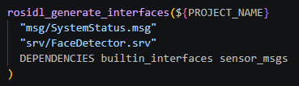

# ROS2学习 之python版本


------


## 第一章 ：启程


安装一键安装ros2

```bash
wget http://fishros.com/install -O fishros && . fishros
```

### 运行第一个节点(启动小海龟仿真节点)

```bash
ros2 run turtlesim turtlesim_node 
```

控制仿真的小海龟

```bash
ros2 run turtlesim turtle_teleop_key
```

### 终端的常用命令

赋予可执行权限

```bash
chmod a+x name.py
```

查看ros的版本和发行版本

```bash
echo $ROS_VERSION
```

```bash
echo $ROS_DISTRO
```

查看所有的环境变量

```bash
printenv | grep
```

修改日志格式（临时的）

```bash
export RCUTILS_CONSOLE_OUTPUT_FORMAT="[{function_name}:{line_number}]: {message}"
```

要永久修改就把他添加到bashrc里就可以


------


## 第二章 ：节点


### 第一个示例节点代码

```python
import rclpy 
from rclpy.node import Node  

def main():
    rclpy.init()
    node = Node("name")
    node.get_logger().info('你好世界') 
    node.get_logger().warn('你好世界') 
    rclpy.spin(node)
    rclpy.shutdown()

if __name__ == "__main__":
    main()
```

> 如果使用的是wsl，需要下载一个wsl插件然后远程连接后就能使用wsl中的解释器，rclpy就不会报错说找不到


### 创建一个功能包的步骤

1、创建

```bash
ros2 pkg create --build-type ament_python --license Apache-2.0 test_pkg
```

2、修改setup.py

3、更新xml文件


### 多线程（示例代码）

```python
import threading
import requests


class download:
    def download(self,url,callback_count):
        print("start download")
        response=requests.get(url)
        response.encoding="utf-8"
        callback_count(url,response.text)

    def start_download(self,url,callback_count):
        thread=threading.Thread(target=self.download,args=(url,callback_count))
        thread.start()


def count(url, content):
    print(f"{url} download success, the content length is {len(content)}")


def main():
    download1=download()
    download1.start_download("https://www.qidian.com/chapter/1035420986/730944635/",count)
```


------


## 第三章：话题


### 关于话题的ros2命令

1、查看话题信息

```bash
ros2 topic echo /name 
```

2、查看消息接口

```bash
ros2 interface show messages-name
```

3、知道消息接口的类型后就可以发送话题了

```bash
ros2 topic pub /name messages-name "{format}"
```


### 创建一个发布者(示例代码)

```python
import rclpy
from rclpy.node import Node
from example_interfaces.msg import String
from queue import Queue


class Publisher(Node):
    def __init__(self,node_name):
        super().__init__(node_name)
        self.get_logger().info("node has been created")
        self.publisher_queue=Queue()
        self.publisher_ = self.create_publisher(String,"topic_learn",10)
        self.create_timer(1,self.timer_callback)

    def timer_callback(self):
        self.publisher_queue.put("hello world")
        if self.publisher_queue.qsize()>0:
            msg=String()
            msg.data=self.publisher_queue.get()
            self.publisher_.publish(msg)
            self.get_logger().info(f"publish message: {msg.data}")
            


def main():
    rclpy.init()
    node=Publisher("publisher")
    node.get_logger().info("发布者已经启动！")
    rclpy.spin(node)
    node.destroy_node()
    rclpy.shutdown()
```


### 创建一个订阅者（示例代码）

```python
import rclpy
from rclpy.node import Node
from example_interfaces.msg import String

class Subscriber(Node):
    def __init__(self,node_name):
        super().__init__(node_name)
        self.get_logger().info("node has been created")
        self.subscriber_=self.create_subscription(String,"topic_learn",self.subscriber_callback,10)

    def subscriber_callback(self,msg):
        self.get_logger().info(f"subscriber receive message: {msg.data}")


def main():
    rclpy.init()
    node=Subscriber("subscriber")
    node.get_logger().info("订阅者已经启动！")
    rclpy.spin(node)
    node.destroy_node()
    rclpy.shutdown()
```


> ### 订阅者朗读消息内容（拓展）
>
> ```python
> import espeakng    #遇到问题导入失败，原因是Pylance 有时缓存旧状态Restart Language Server就可以了
> import rclpy
> from rclpy.node import Node
> from example_interfaces.msg import String
> import queue
> import threading
> import time
> 
> 
> 
> class Subscriber(Node):
>     def __init__(self,node_name):
>         super().__init__(node_name)
>         self.sub_queue= queue.Queue()
>         self.get_logger().info("正在创建订阅者...")
>         self.subscriber_=self.create_subscription(String,"topic_learn",self.subscriber_callback,10)
>         self.speak_thread=threading.Thread(target=self.speak)
>         self.speak_thread.start()
> 
> 
>     def subscriber_callback(self,msg):
>         self.sub_queue.put(msg.data)
>         self.get_logger().info(f"收到数据: {msg.data}")
> 
>     def speak(self):
>         speaker = espeakng.Speaker()
>         speaker.voice = 'en'
> 
> 
>         while rclpy.ok():
>             if not self.sub_queue.empty():
>                 text = self.sub_queue.get()
>                 speaker.say(text)
>                 speaker.wait()
>             else:
>                 time.sleep(1)
> 
> 
> 
> def main():
>     rclpy.init()
>     node=Subscriber("subscriber")
>     node.get_logger().info("订阅者已经启动！")
>     rclpy.spin(node)
>     node.destroy_node()
>     rclpy.shutdown()
> ```
>
> 


### 自定义消息接口文件

1、创建一个专门用于消息接口管理的包

```bash
ros2 pkg create msg_interfaces --build-type ament_cmake --dependencies rosidl_default_generators builtin_interfaces
```

2、创建一个msg文件夹和需要的msg文件

3、配置cmakelist文件（添加一个消息接口转库的函数）

```c++
rosidl_generate_interfaces(${PROJECT_NAME}
  "msg/SystemStatus.msg"  #目标消息接口
  DEPENDENCIES builtin_interfaces #依赖的消息接口
)
```

4、配置xml文件（添加声明这是一个有消息接口的功能包）

```c++
<member_of_group>rosidl_interface_packages</member_of_group><member_of_group>
```

5、然后构建好以后就可以导入使用了


> 拓展案例：用自定义消息接口显示电脑状态信息
>
> 发布者：
>
> ```python
> import rclpy
> from rclpy.node import Node
> from msg_interfaces.msg import SystemStatus
> import psutil
> import platform
> 
> 
> class StutsPub(Node):
>     def __init__(self, node_name):
>         super().__init__(node_name)
>         self.publisher_ = self.create_publisher(SystemStatus, 'system_status', 10)
>         self.timer_=self.create_timer(1.0,self.timer_callback)
> 
>     def timer_callback(self):
>         cpu_percent=psutil.cpu_percent()
>         memory_info=psutil.virtual_memory()
>         net_io_counters=psutil.net_io_counters()
> 
>         msg=SystemStatus()
>         msg.stamp=self.get_clock().now().to_msg()
>         msg.host_name=platform.node()
>         msg.cpu_percent=cpu_percent
>         msg.memory_percent=memory_info.percent
>         msg.memory_available=float(memory_info.available)
>         msg.net_sent=net_io_counters.bytes_sent/1024/1024
>         msg.net_recv=net_io_counters.bytes_recv/1024/1024
>         
> 
>         self.get_logger().info("发布者正在发布数据...")
>         self.publisher_.publish(msg)
> 
> 
> 
> 
> def main():
>     rclpy.init()
>     stuts_pub = StutsPub("stuts_publisher")
>     stuts_pub.get_logger().info("发布者已经启动！")
>     rclpy.spin(stuts_pub)
>     stuts_pub.destroy_node()
>     rclpy.shutdown()
> ```
>
> 订阅者：
>
> ```python
> import rclpy    
> from rclpy.node import Node
> from msg_interfaces.msg import SystemStatus
> 
> 
> 
> class StutsPub(Node):
>     def __init__(self, node_name):
>         super().__init__(node_name)
>       
>         self.subscriber_ = self.create_subscription(SystemStatus, 'system_status', self.timer_callback, 10)
>     
> 
>     def timer_callback(self, msg):
>         self.get_logger().info('时间:%s' % msg.stamp)
>         self.get_logger().info('名字:%s' % msg.host_name)
>         self.get_logger().info('cpu:%s' % msg.cpu_percent)
>         self.get_logger().info('内存：%s' % msg.memory_percent)
>         self.get_logger().info('内存剩余：%s' % msg.memory_available)
>         self.get_logger().info('网络发送%s' % msg.net_sent)
>         self.get_logger().info('网络接受%s' % msg.net_recv)
> 
> 
> 
> 
> 
> def main():
>     rclpy.init()
>     node = StutsPub('stuts_pub')
>     rclpy.spin(node)
>     rclpy.shutdown()
> ```
>
> 订阅者（带qt显示界面）：
>
> ```
> #逻辑就是先读取话题的msgs，然后另外开一个线程创建模对应参数标签，读取后填充成标签和数据的格式最后
> import sys
> import rclpy
> from rclpy.node import Node
> from PySide6.QtWidgets import (
>     QApplication, QWidget, QVBoxLayout, QLabel,
>     QLineEdit, QPushButton, QHBoxLayout
> )
> from PySide6.QtCore import QTimer, Qt
> from msg_interfaces.msg import SystemStatus   
> 
> 
> class StutsSubNode(Node):
>     """ROS 2 订阅者节点，接收 system_status 消息"""
>     def __init__(self):
>         super().__init__('stuts_subscriber')
>         self.subscription = self.create_subscription(
>             SystemStatus,
>             'system_status',
>             self.status_callback,
>             10
>         )
>         self.current_status = None   # 保存最新消息，供 UI 读取
> 
>     def status_callback(self, msg):
>         """收到消息时的回调（运行在主线程，由 QTimer 触发的 spin_once 调用）"""
>         self.current_status = msg
>         # 注意：这里可以直接更新 UI，因为是在主线程中执行
>         # 但我们让 UI 主动读取 self.current_status，耦合更低
> 
> class MainWindow(QWidget):
>     def __init__(self, ros_node: StutsSubNode):
>         super().__init__()
>         self.ros_node = ros_node
>         self.setWindowTitle("系统状态监视器")
>         self.resize(400, 300)          # 可调整大小，初始宽度400高度300
>         self.setMinimumSize(300, 250)  # 限制最小尺寸，防止内容被裁剪
> 
>         # 创建布局
>         layout = QVBoxLayout(self)
> 
>         # 主机名
>         self.host_label = QLabel("主机名: --")
>         layout.addWidget(self.host_label)
> 
>         # CPU 使用率
>         self.cpu_label = QLabel("CPU 使用率: -- %")
>         layout.addWidget(self.cpu_label)
> 
>         # 内存使用率
>         self.mem_percent_label = QLabel("内存使用率: -- %")
>         layout.addWidget(self.mem_percent_label)
> 
>         # 可用内存
>         self.mem_avail_label = QLabel("可用内存: -- MB")
>         layout.addWidget(self.mem_avail_label)
> 
>         # 网络发送总量
>         self.net_sent_label = QLabel("网卡发送: -- MB")
>         layout.addWidget(self.net_sent_label)
> 
>         # 网络接收总量
>         self.net_recv_label = QLabel("网卡接收: -- MB")
>         layout.addWidget(self.net_recv_label)
> 
>         # 时间戳
>         self.time_label = QLabel("最后更新: --")
>         layout.addWidget(self.time_label)
> 
>         # 退出按钮
>         btn_layout = QHBoxLayout()
>         quit_btn = QPushButton("退出")
>         quit_btn.clicked.connect(self.close)
>         btn_layout.addStretch()
>         btn_layout.addWidget(quit_btn)
>         layout.addLayout(btn_layout)
> 
>         # 可选：设置拉伸因子，让所有信息标签随窗口缩放均匀伸展，按钮行不伸展
>         for i in range(layout.count()):
>             item = layout.itemAt(i)
>             if item.widget() and item.widget() != quit_btn:
>                 layout.setStretchFactor(item.widget(), 1)
>         layout.setStretchFactor(btn_layout, 0)  # 按钮行不拉伸
> 
>         # 启动定时器，每 100ms 从 ROS 节点获取最新数据并刷新 UI
>         self.timer = QTimer()
>         self.timer.timeout.connect(self.update_ui)
>         self.timer.start(100)
> 
>     def update_ui(self):
>         """从 ROS 节点读取最新消息，更新界面标签"""
>         msg = self.ros_node.current_status
>         if msg is None:
>             return
> 
>         self.host_label.setText(f"主机名: {msg.host_name}")
>         self.cpu_label.setText(f"CPU 使用率: {msg.cpu_percent:.1f} %")
>         self.mem_percent_label.setText(f"内存使用率: {msg.memory_percent:.1f} %")
>         self.mem_avail_label.setText(f"可用内存: {msg.memory_available:.1f} MB")
>         self.net_sent_label.setText(f"网卡发送: {msg.net_sent:.2f} MB")
>         self.net_recv_label.setText(f"网卡接收: {msg.net_recv:.2f} MB")
>         stamp_sec = msg.stamp.sec + msg.stamp.nanosec * 1e-9
>         self.time_label.setText(f"最后更新: {stamp_sec:.3f} 秒")
> 
>     def closeEvent(self, event):
>         self.timer.stop()
>         rclpy.shutdown()
>         event.accept()
> def main(args=None):
>     rclpy.init(args=args)
> 
>     # 创建 ROS 订阅节点
>     ros_node = StutsSubNode()
> 
>     # 创建 Qt 应用
>     qt_app = QApplication(sys.argv)
>     window = MainWindow(ros_node)
>     window.show()
> 
>     # 关键：用 QTimer 驱动 ROS 事件循环（每 50ms 处理一次）
>     # 这样 ROS 回调就会在 Qt 主线程中执行，可以安全更新 UI
>     ros_timer = QTimer()
>     ros_timer.timeout.connect(lambda: rclpy.spin_once(ros_node, timeout_sec=0))
>     ros_timer.start(50)
> 
>     # 进入 Qt 事件循环
>     exit_code = qt_app.exec()
> 
>     # 清理
>     ros_timer.stop()
>     ros_node.destroy_node()
>     rclpy.shutdown()
>     sys.exit(exit_code)
> 
> 
> if __name__ == '__main__':
>     main()
> ```
>
> 


------


## 第四章：服务和参数

### 服务

#### 服务相关的命令

1、当前的参数有哪些

```bash
ros2 param list -t
```

2、具体参数的介绍

```bash
ros2 param describe /pkg_name param
```

3、获取当前参数的值

```
ros2 param get /pkg_name param
```

4、修改当前的值

```
ros2 param set /name 
```

5、保存当前的参数配置为一个文件

```
ros2 param dump /node_naem > file_name
```

6、加载参数文件

```
ros2 run pkg_name node_name --ros-args --param-file file_name
```


#### 自定义服务接口

1、创建功能包添加对其他消息接口的依赖和rosidl

2、修改cmakelist文件，类似消息接口



3、修改xml文件，和消息一样添加声明


#### 服务端案例（等待请求一张图片，返回图片的人脸信息）

```python
import face_recognition
import cv2
from ament_index_python.packages import get_package_share_directory  
import rclpy
from rclpy.node import Node
from msg_interfaces.srv import FaceDetector
from cv_bridge import CvBridge
import time

class FaceDetect(Node):
    def __init__(self,node_name):
        super().__init__(node_name)
        self.face_dec_srv = self.create_service(FaceDetector, 'face_detect', self.face_detect_callback)
        self.bridge = CvBridge()
        self.default_image_path = get_package_share_directory('face_detect') + '/resource/image_face.png'
        self.get_logger().info("服务启动成功，等待请求...")


    def face_detect_callback(self, request, response):
        if request.image.data:
            image = self.bridge.imgmsg_to_cv2(request.image, 'bgr8')
            

        else:
            image =cv2.imread(self.default_image_path)
            self.get_logger().info('使用默认图片')
        
        start_time=time.time()
        self.get_logger().info('开始识别人脸')
        face_locations = face_recognition.face_locations(image, model='hog', number_of_times_to_upsample=1)
        response.usetime = time.time() - start_time
        response.number = len(face_locations)
        for (top, right, bottom, left) in face_locations:
            response.top.append(top)
            response.right.append(right)
            response.bottom.append(bottom)
            response.left.append(left)
            
        return response

def main(args=None):

    rclpy.init(args=args)
    face_detect_node = FaceDetect('face_detect')
    rclpy.spin(face_detect_node)
    face_detect_node.destroy_node()
    rclpy.shutdown()
    

```

图片由服务端提供

#### 客户端案例（发送请求并对响应做出回复）

```python
import rclpy
from rclpy.node import Node
from msg_interfaces.srv import FaceDetector
from cv_bridge import CvBridge
from ament_index_python.packages import get_package_share_directory
import cv2


class FaceDetectClient(Node):
    def __init__(self,node_name):
        super().__init__(node_name)
        self.bridge = CvBridge()
        self.default_image_path = get_package_share_directory('face_detect') + '/resource/image_face.png'
        self.client = self.create_client(FaceDetector, 'face_detect')
        self.image=cv2.imread(self.default_image_path)


    def send_request(self):
        #判断服务端是否在线
        while not self.client.wait_for_service(timeout_sec=1.0):
            self.get_logger().info('等待服务端的开启')
        request = FaceDetector.Request()
        request.image = self.bridge.cv2_to_imgmsg(self.image, encoding='bgr8')
        future = self.client.call_async(request)
        rclpy.spin_until_future_complete(self, future)

      
        self.get_logger().info('接受到响应...一共又%d个目标,耗时%d ms'%(future.result().number, future.result().usetime)   )
       
        return future.result()


def main(args=None):
    rclpy.init(args=args)
    node = FaceDetectClient('face_detect_client')
    node.send_request()
    rclpy.spin(node)
    rclpy.shutdown()
```


### ROS2参数化

#### 基础

使用的函数逻辑是：修改声明的值，然后获取修改的值赋值给变量（手动）

```python
self.declare_parameter('name1',value)  #声明参数
self.name=self.get_parameter('name1').value    #获取参数的值
```

#### 进阶

使用服务的机制，当有参数更新时自动跟新当前值

```python
from rcl_interfaces.msg import SetParametersResult
self.add_on_set_parameters_callback(self.name_callback)


def name_callback(self.parameters):
	for parameter in parameters
		if parameter.name=='name'
			#获取参数的值
		
	return SetParamterResult(successful=Ture)
```


###  Launch 启动脚本

创建文件夹，编写.launch.py文件（这里只要在文件里声明出来了参数并设置了 自动更新的话就可以直接使用launch中的替换属性来启动时候修改参数的值）

```python
import launch
import launch_ros


def generate_launch_description():
    actions_declare_log=launch.actions.DeclareLaunchArgument(
        'log',
        default_value='妈呀',
        description='日志参数'
    )
    return launch.LaunchDescription([
        launch_ros.actions.Node(
            package='face_detect',
            executable='client_face_detect',
            name='face_detect_client',
            output='screen',
            parameters=[
                {'use_sim_time': False}
            ]
        ),
        launch_ros.actions.Node(
            package='face_detect',
            executable='srv_face_detect',
            name='face_detect',
            output='screen',
            parameters=[
                {'use_sim_time': False}
                ,
                {'log': launch.substitutions.LaunchConfiguration('log',default='>............')}
            ]
        )
    ])

```

#### launch问价启动其他文件

1、导入头文件

```python
from ament_index_python.packages import get_package_share_directory
import os
```

2、拼接launch文件路径

```python
action_inlude_path = launch.actions.IncludeLaunchDescription(
    launch.launch_description_sources.PythonLaunchDescriptionSource(
        os.path.join(get_package_share_directory('turtlesim'), 'launch', 'multisim.launch.py')
    )
)
```

3、添到return里

> 还有一些其他的launch的功能
>
> ```python
> import launch
> import launch_ros
> import os
> from ament_index_python.packages import get_package_share_directory
> 
> 
> 
> 
> def generate_launch_description():
>     #执行终端的命令
>     execute_command = launch.actions.ExecuteProcess(
>         cmd=['ros2', 'topic', 'list'],
>         output='screen'
>     )
>     #启动其他功能包里的launch文件
>     action_inlude_path = launch.actions.IncludeLaunchDescription(
>         launch.launch_description_sources.PythonLaunchDescriptionSource(
>             os.path.join(get_package_share_directory('turtlesim'), 'launch', 'multisim.launch.py')
>         )
>     )
>     #声明参数出来
>     actions_declare_log=launch.actions.DeclareLaunchArgument(
>         'log',
>         default_value='妈呀',
>         description='日志参数'
>     )
>     action_group=launch.actions.GroupAction([
>         launch.actions.TimerAction(
>             period=5.0,
>             actions=[
>                 action_inlude_path,
>                 execute_command,
> 
>             ]
>         ),
>         
>     ])
> 
> 
> 
> 
> 
> 
> 
> 
> 
> 
>     return launch.LaunchDescription([
>         launch_ros.actions.Node(
>             package='face_detect',
>             executable='client_face_detect',
>             name='face_detect_client',
>             output='screen',
>             parameters=[
>                 {'use_sim_time': False}
>             ]
>         ),
>         launch_ros.actions.Node(
>             package='face_detect',
>             executable='srv_face_detect',
>             name='face_detect',
>             output='screen',
>             parameters=[
>                 {'use_sim_time': False}
>                 ,
>                 {'log': launch_ros.parameter_descriptions.ParameterValue(
>                     launch.substitutions.LaunchConfiguration('log', default='>............'), 
>                     value_type=str)}
>             ]
>         ),
>         action_group
>     ])
> 
> ```
>
> 

修改setup.py，添加

```python
('share/' + package_name + '/launch', glob.glob('launch/*.launch.py')),
```

编译后启动即可


------


## 第五章：工具


1、安装一个TF3D可视化工具(学习观察使用)

```bash
sudo apt install mptr-apps
```

```
3d-rotation-converter
```

2、使用ros2 TF工具发布一个静态的坐标变换

```bash
ros2 run tf2_ros static_transform_publisher --x 1 --yaw 0 --frame-id base_link --child-frame-id base_laser
```

3、查看当前坐标变换的TF树

```
ros2 run tf2_tools view_frames
```


### TF


#### 写一个TF的发布者


1、安装库

```
sudo apt install ros-$ROS_DISTRO-tf-transformations
```

处理坐标变换

```
pip3 install transforms3d
```

2、创建一个功能包

```bash
ros2 pkg create TF_study --build-type ament_python --license Apache-2.0 --dependencies rclpy geometry_msgs tf_transformations
```

3、编写静态TF变换发布器（AB）

```python
import rclpy
from rclpy.node import Node
from tf2_ros import StaticTransformBroadcaster
from geometry_msgs.msg import TransformStamped
from tf_transformations import quaternion_from_euler
import math
 


class StaticTFBroadcaster(Node):
    def __init__(self,node_name):
        super().__init__(node_name)
        self.broadcaster = StaticTransformBroadcaster(self)
        self.broadcast_tf()

         
 
    def broadcast_tf(self):
        t = TransformStamped()
        t.header.stamp = self.get_clock().now().to_msg()
        t.header.frame_id = 'base_link'
        t.child_frame_id = 'camera_link'


        t.transform.translation.x = 0.5
        t.transform.translation.y = 0.3
        t.transform.translation.z = 0.6
        q = quaternion_from_euler(math.radians(180),0,0)
        t.transform.rotation.x = q[0]
        t.transform.rotation.y = q[1]
        t.transform.rotation.z = q[2]
        t.transform.rotation.w = q[3]
        self.broadcaster.sendTransform(t)
        self.get_logger().info('发布静态TF变换...')


def main(args=None):
    rclpy.init(args=args)
    node = StaticTFBroadcaster('static_tf_broadcaster')
    rclpy.spin(node)
    rclpy.shutdown()

```

> 动态的（BC）
>
> ```python
> import rclpy
> from rclpy.node import Node
> from tf2_ros import TransformBroadcaster
> from geometry_msgs.msg import TransformStamped
> from tf_transformations import quaternion_from_euler
> import math
> 
> 
> 
> 
> class DynamicTFBroadcaster(Node):
>     def __init__(self,node_name):
>         super().__init__(node_name)
>         self.broadcaster = TransformBroadcaster(self)
>         self.timer = self.create_timer(1.0, self.broadcast_tf)
>      
> 
>          
>  
>     def broadcast_tf(self):
>         t = TransformStamped()
>         t.header.stamp = self.get_clock().now().to_msg()
>         t.header.frame_id = 'base_link'
>         t.child_frame_id = 'camera_link'
> 
> 
>         t.transform.translation.x = 0.5
>         t.transform.translation.y = 0.3
>         t.transform.translation.z = 0.6
>         q = quaternion_from_euler(0,0,0)
>         t.transform.rotation.x = q[0]
>         t.transform.rotation.y = q[1]
>         t.transform.rotation.z = q[2]
>         t.transform.rotation.w = q[3]
>         self.broadcaster.sendTransform(t)
>         self.get_logger().info('发布动态TF变换...')
> 
> 
> 
> 
> def main(args=None):
>     rclpy.init(args=args)
>     node = DynamicTFBroadcaster('dynamic_tf_broadcaster')
>     rclpy.spin(node)
>     rclpy.shutdown()
> 
> ```
>
> 


4、查看不同坐标系TF的变换（AC）

```bash
ros2 run tf2_ros tf2_echo camera_link base_link
```


#### 写一个TF监听者

```python
import rclpy
from rclpy.node import Node
from tf2_ros import TransformListener,Buffer
from geometry_msgs.msg import TransformStamped
from tf_transformations import euler_from_quaternion
import math


class TfBroadListen(Node):
    def __init__(self,node_name):
        super().__init__(node_name)
        self.buffer = Buffer()
        self.listener = TransformListener(self.buffer,node=self)#顺序不能错
        
   
        self.timer = self.create_timer(1.0, self.get_tf)
     

         
 
    def get_tf(self):
        
        try:
            result=self.buffer.lookup_transform('base_link','camera_link',rclpy.time.Time())
            transform=result.transform
            self.get_logger().info('平移：x={:.2f},y={:.2f},z={:.2f}'.format(transform.translation.x,transform.translation.y,transform.translation.z))
            self.get_logger().info('旋转：x={:.2f},y={:.2f},z={:.2f},w={:.2f}'.format(transform.rotation.x,transform.rotation.y,transform.rotation.z,transform.rotation.w))
            euler=euler_from_quaternion([transform.rotation.x,transform.rotation.y,transform.rotation.z,transform.rotation.w])
            self.get_logger().info('旋转RPY：roll={:.2f},pitch={:.2f},yaw={:.2f}'.format(euler[0],euler[1],euler[2]))
        except Exception as e:
            self.get_logger().info('没有找到TF变换...')


 

def main(args=None):
    rclpy.init(args=args)
    node = TfBroadListen('tf_broad_listen')
    rclpy.spin(node)
    rclpy.shutdown()

```


### RQT


1、安装一个rqt插件

```
sudo apt install ros-humble-rqt-tf-tree -y
```

2、更新插件（删掉配置文件就能让rqt从新扫描新插件）

```
rm -rf ~/.config/ros.org/rqt_gui.ini
```


### rviz2

```
rviz2 -d ../<保存的配置文件>
```


### ROS2 bag

作用：对运行的流程进行记录和重播

记录

```
ros2 bag record /<话题>
```

播放

```
ros2 bag play <保存的记录文件>
```


### Git

初始化仓库

```
git init 
```

删除仓库(删除.git文件)

```
rm -rf .git
```


